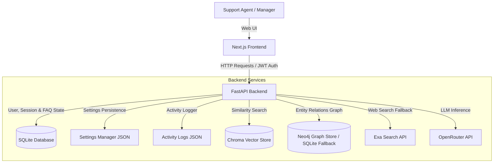

# Kairo - Enterprise Compliance & Support Knowledge Graph Copilot

Kairo is an enterprise-grade customer support assistant, document compliance auditor, and multi-modal knowledge graph RAG (Retrieval-Augmented Generation) platform. It integrates a deterministic FAQ matching layer, a dense passage retrieval (RAG) system, an enterprise compliance Neo4j Knowledge Graph (with persistent SQLite fallback), and an automated web search fallback with analytics logging.

The architecture consists of a Next.js (TypeScript/Tailwind CSS) frontend communicating with a FastAPI backend. Structured relational data is stored in SQLite, vector indexes in ChromaDB, and entity relationship graphs in Neo4j (or SQLite fallback).

---

## System Architecture



---

## Core Technical Pipelines

### 1. Canned FAQ Matching Layer
Prior to vector retrieval, graph queries, or LLM inference, user queries are routed through a canned FAQ matching system.
* **Deterministic Matching**: Evaluates user questions against active keyword rules stored in the SQLite database.
* **Longest-Prefix Strategy**: If multiple configured keywords match the input text, the backend selects the rule with the longest matching keyword.
* **Bypass Execution**: Returns the mapped response immediately, reducing latency to sub-millisecond ranges and avoiding LLM API token consumption.

### 2. Dense Passage Retrieval (RAG)
For query patterns not matched by the FAQ layer, the backend initiates document retrieval.
* **Vector Indexing**: Documents (PDF, TXT, DOCX) uploaded by managers are processed, chunked, and saved in a persistent ChromaDB instance.
* **Embeddings Model**: Utilizes `openai/text-embedding-ada-002` via OpenRouter to generate 1536-dimensional dense vectors.
* **Context Generation**: Performs similarity searches matching top-K chunks. Only context chunks exceeding the similarity threshold are passed to the language model.
* **LLM Orchestration**: Combines retrieved context blocks with the system prompt, sending the request to a high-capacity model (e.g., `openai/gpt-oss-120b`) via OpenRouter.

### 3. Enterprise Knowledge Graph RAG (Graph RAG)
Documents uploaded to Kairo are synthesized into a Compliance Knowledge Graph mapping complex relationships between regulations, policies, requirements, and systems.
* **10-Stage Ingestion Ingestion logging**: Document ingestion proceeds through 10 strict logging stages:
  - Stage 1: Upload Completed
  - Stage 2: Background Task Started
  - Stage 3: Chunks Received from Parser
  - Stage 4: graph_builder.extract() Executing for Chunk
  - Stage 5: LLM Extraction Returned
  - Stage 6: Entity Resolution Consolidated
  - Stage 7: graph_repository.save() Executing
  - Stage 8: Graph MERGE Queries Succeeded
  - Stage 9: Graph Statistics Refreshed
  - Stage 10: Ingestion Completed
* **Entity Resolution**: Normalized entity names consolidates variant names (e.g., "ISO 27001", "ISO-27001", "ISO/IEC 27001") under a single canonical UUID to build clean visual network maps.
* **Ontology Matching**: Extracts specific entities (Regulation, Policy, Requirement, Control, Risk, Asset) and relationships (IMPLEMENTS, SATISFIES, MITIGATES, REFERENCES, VIOLATES).
* **SQLite Fallback**: If a Neo4j database is not configured or goes offline, Kairo automatically falls back to a persistent local SQLite graph database (`kairo_graph_fallback.db`).

### 4. Adaptive Web Fallback & Gap Analytics
If the vector store or graph retrieval yields no results or if similarity scores fall below the specified threshold:
* **Context Refusal Detection**: If the LLM generates a refusal message (e.g., "Sorry, I don't know based on the given context"), or if retrieval scores are low, the fallback trigger is activated.
* **Exa Web Search**: Conducts an external web search using Exa API, routing response summaries and verified citations back to the agent.
* **Knowledge Gap Logging**: Records the failed query, its highest similarity score, and the fallback status to the `failed_retrievals` table. Managers can view these gap reports to identify missing documentation areas.

---

## Dynamic Configuration Engine

Administrators can modify system settings in real time via the Advanced Settings panel. Configurations are persisted in `settings.json`:
* **Chunk Parameters**: Adjust `chunk_size` and `chunk_overlap` for document parsing.
* **Retrieval Limits**: Tune `top_k` (number of chunks retrieved) and `max_context_chunks`.
* **Similarity Threshold**: Define the minimum relevance score required to accept local document context.
* **Inference Temperature**: Tweak the creativity/determinism of the LLM responses.
* **Feature Toggles**: Enable/disable the FAQ Router, Exa Web Fallback, or Failed Retrievals Logging.
* **System Prompt Editor**: Edit instructions dynamically without restarting the FastAPI service.

---

## API Reference

### User Authentication & Management
| Method | Endpoint | Description | Auth Required |
| :--- | :--- | :--- | :--- |
| `POST` | `/register` | Create a new technician account | No |
| `POST` | `/register_admin` | Bootstrap the first manager (needs `ADMIN_SETUP_TOKEN`) | No\* |
| `POST` | `/admin/users` | Create further accounts of either role | Yes (Admin) |
| `POST` | `/token` | Authenticate user (returns JWT) | No |
| `GET` | `/users/me` | Fetch active user information | Yes |

### Document Corpus Management
| Method | Endpoint | Description | Auth Required |
| :--- | :--- | :--- | :--- |
| `POST` | `/upload` | Upload a document; indexing runs in the background (202) | Yes (Admin) |
| `GET` | `/files` | List the corpus with per-document indexing status | Yes (Admin) |
| `GET` | `/files/{doc_id}/status` | Poll indexing progress for one document | Yes (Admin) |
| `DELETE` | `/files/{filename}` | Delete a document and purge its embeddings | Yes (Admin) |
| `POST` | `/reindex/{filename}` | Re-index a document in the background | Yes (Admin) |

### Deterministic FAQ Rules
| Method | Endpoint | Description | Auth Required |
| :--- | :--- | :--- | :--- |
| `GET` | `/faq` | Get list of all canned FAQ rules | Yes (Admin) |
| `POST` | `/faq` | Add a new canned FAQ rule | Yes (Admin) |
| `DELETE` | `/faq/{id}` | Remove a canned FAQ rule | Yes (Admin) |

### Knowledge Graph & Graph RAG
| Method | Endpoint | Description | Auth Required |
| :--- | :--- | :--- | :--- |
| `POST` | `/graph/query` | Execute Graph RAG question backed by Neo4j graph context | Yes |
| `GET` | `/graph/visualize` | Retrieve nodes and edges for visual network graphing | Yes |
| `GET` | `/graph/stats` | Get node counts, relationship counts, and indexed docs | Yes |
| `DELETE` | `/graph/documents/{doc_id}` | Purge document graph nodes and edges from the store | Yes (Admin) |
| `POST` | `/graph/ingest` | Manually trigger Knowledge Graph extraction for a document | Yes (Admin) |

### Analytics & Auditing
| Method | Endpoint | Description | Auth Required |
| :--- | :--- | :--- | :--- |
| `GET` | `/analytics/gaps` | Failed-retrieval analytics & gap reports | Yes (Admin) |
| `GET` | `/analytics/feedback` | Answer-quality stats from thumbs up/down | Yes (Admin) |
| `GET` | `/analytics/audit` | Append-only audit trail of queries and actions | Yes (Admin) |

### Chat Sessions
| Method | Endpoint | Description | Auth Required |
| :--- | :--- | :--- | :--- |
| `POST` | `/sessions` | Create a chat session | Yes |
| `POST` | `/sessions/{id}/ask` | Ask a question — returns answer + citations + confidence | Yes |
| `GET` | `/sessions/{id}/messages` | Load a conversation with its stored citations | Yes |
| `POST` | `/messages/{id}/feedback` | Rate an answer `helpful` / `not_helpful` | Yes |

\* Only succeeds while no manager account exists and the request carries the correct `setup_token`.

---

## Database Schema & Persistence

### SQLite Tables (`users.db`)
* **`users`**: Manages credentials, password hashing (bcrypt), and roles.
* **`chat_sessions`**: Stores user chat sessions, allowing history retention.
* **`chat_messages`**: Maintains individual message logs associated with sessions.
* **`faq_rules`**: Stores keyword-to-response mappings and active flags.
* **`failed_retrievals`**: Tracks search inputs that fell below the similarity threshold.

### Knowledge Graph Persistence
* **Neo4j DB (Primary)**: Stores entities as graph nodes (e.g. `:Entity {id, canonical_name, aliases, entity_type}`) and relationships as edges (e.g., `-[:MITIGATES]->`).
* **SQLite fallback (`kairo_graph_fallback.db`)**: Active when Neo4j is offline. Stores data in `entities`, `relationships`, and `provenance` tables.

### Audit Logging (`activity_logs.json`)
A thread-safe logger records administrative actions:
* User logins and logouts.
* Document uploads and deletions.
* Document re-indexing triggers.
* FAQ rule modifications.

---

## Development Setup

### 1. Backend Configuration
1. Navigate to the backend directory:
   ```bash
   cd Backend
   ```
2. Set up up a Python virtual environment:
   ```bash
   python -m venv venv
   # Activate on Windows:
   .\venv\Scripts\activate
   # Activate on macOS/Linux:
   source venv/bin/activate
   ```
3. Install dependencies:
   ```bash
   pip install -r requirements.txt
   ```
4. Create a `.env` file in the project root:
   ```env
   OPENROUTER_API_KEY=your_openrouter_api_key
   EXA_API_KEY=your_exa_api_key

   # Required - the app refuses to start without it.
   SECRET_KEY=your_jwt_secret_key

   ALLOWED_ORIGINS=http://localhost:3000
   ADMIN_SETUP_TOKEN=some-one-time-token

   # Neo4j Settings (If left empty, the system defaults to SQLite fallback DB)
   NEO4J_URI=bolt://localhost:7687
   NEO4J_USER=neo4j
   NEO4J_PASSWORD=password
   ```
5. Launch the FastAPI server:
   ```bash
   uvicorn app:app --reload --port 8000
   ```

### 2. Frontend Configuration
1. Navigate to the `frontend` directory:
   ```bash
   cd frontend
   ```
2. Install npm packages:
   ```bash
   npm install
   ```
3. Create a `.env.local` file:
   ```env
   NEXT_PUBLIC_API_URL=http://localhost:8000
   ```
4. Run the Next.js development server:
   ```bash
   npm run dev
   ```
5. Access the user interface at `http://localhost:3000`.

---

## System Verification

To run automated checks and verify API and knowledge graph correctness, execute the testing modules in the Backend directory:

```bash
# Verify base retrieval and RAG grounding
python test_grounding.py

# Verify API authentication, FAQ, and analytics endpoints
python test_api.py

# Verify Entity Resolution, Graph database, and extraction
python test_knowledge_graph.py
```
