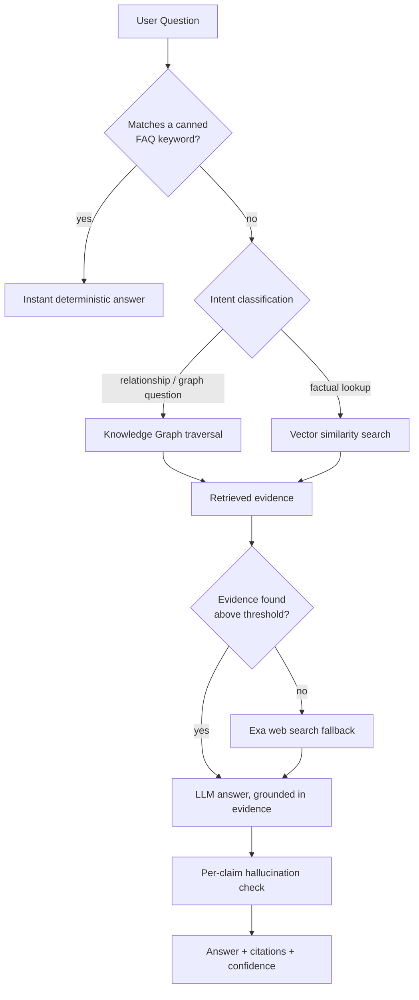
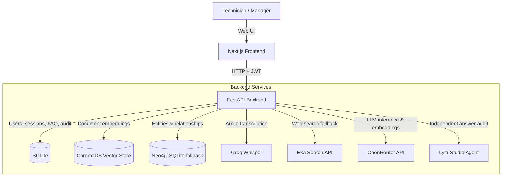

# Kairo — Enterprise Compliance & Support Knowledge Copilot

Kairo is a compliance and support assistant for organizations that sit on top of a pile of unstructured policy documents — PDFs, Word docs, even audio recordings of audits — and need a way to *ask questions* of that pile and trust the answer.

It does three things most simple "chat with your PDF" tools don't:

1. **Answers are grounded, not guessed.** Every claim in an answer is traced back to a specific document, page, and chunk. Low-confidence or unsupported answers are flagged instead of stated with false confidence.
2. **It doesn't just retrieve text, it builds a knowledge graph.** Documents are parsed into a network of compliance entities (regulations, controls, risks, vendors, systems...) and the relationships between them, so you can ask relationship questions ("which vendor manages infrastructure connected to the Finance Server?") that plain text search can't answer.
3. **Answers get independently audited.** A second, separate AI agent (via Lyzr Studio) checks a Kairo-generated answer against the same evidence and reports whether every claim actually holds up — a real second opinion, not the same model re-checking its own work.

---

## Who it's for

A manager/admin uploads the organization's compliance documents. Technicians (support agents) then chat with Kairo to answer customer or internal questions, backed by those documents, with citations and confidence scores attached to every answer.

---

## How a question gets answered

Kairo doesn't send every question straight to an LLM. A question is routed through several layers, cheapest and most deterministic first:



1. **FAQ layer** — a deterministic keyword-match table that short-circuits common questions before any AI call is made. Instant, free, and predictable.
2. **Retrieval layer** — for everything else, Kairo decides whether the question is a relationship question (routed to the knowledge graph) or a factual lookup (routed to vector similarity search over the document corpus).
3. **Grounding** — if neither retrieval path finds strong enough evidence, Kairo falls back to a live web search (Exa) rather than letting the model answer from memory.
4. **Answer generation** — the LLM answers strictly from whatever evidence was retrieved, with inline citation markers.
5. **Self-verification** — every generated claim is checked sentence-by-sentence against the retrieved evidence and labeled `SUPPORTED`, `CONTRADICTED`, or `UNVERIFIED / HALLUCINATED`, feeding an overall trust score shown alongside the answer.
6. **Independent audit (optional)** — on top of Kairo's own self-check, a completely separate agent (Lyzr Studio) can be asked to re-verify the same answer against the same evidence, with no access to Kairo's reasoning. See below.

---

## Core modules

### 1. Deterministic FAQ router
Keyword rules configured by an admin are checked before any retrieval or LLM call. If multiple rules match, the longest matching keyword wins. This keeps common questions instant and keeps token spend down.

### 2. Document ingestion & Retrieval-Augmented Generation (RAG)
Admins upload PDFs, Word documents, plain text, or **audio recordings** (automatically transcribed via Groq Whisper before indexing). Documents are chunked, embedded, and stored in a persistent ChromaDB vector index. Questions are answered by retrieving the most similar chunks and passing only evidence above a relevance threshold to the LLM — nothing below threshold reaches the model, so a weak match can't masquerade as a confident answer.

### 3. Compliance Knowledge Graph (Graph RAG)
This is what separates Kairo from a generic document chatbot. Every uploaded document is also run through an LLM extraction pipeline that pulls out compliance entities and the relationships between them:

- **Entity types**: Regulation, Policy, Requirement, Control, Risk, Vendor, Department, Employee, Asset, System, Procedure, Audit, Evidence, Document, Database, Server, Application
- **Relationship types**: OWNS, IMPLEMENTS, SATISFIES, MITIGATES, PROTECTS, USES, DEPENDS_ON, REFERENCES, AUDITS, GENERATED_BY, RELATED_TO, VIOLATES

Entity resolution consolidates variant names of the same real-world thing ("ISO 27001", "ISO-27001", "ISO/IEC 27001") under one canonical node, and every node carries full **provenance** — the exact document, page, and source text it came from — so any fact in the graph can be traced back to where it was said.

The graph is stored in **Neo4j** when configured, and automatically falls back to a persistent local SQLite store when Neo4j isn't available, so the feature never hard-fails in a low-resource or offline environment.

**Interactive visualization**: the Knowledge Graph tab renders the graph as an explorable node network (force-directed or hierarchical layout). Hovering any node surfaces its type, aliases, connection count, and the exact source text it was extracted from. An empty corpus shows a proper onboarding state (what the pipeline does, what entity types it detects) instead of a blank canvas. A built-in **Graph RAG query box** lets you ask relationship questions directly against the graph and see the traversal path used to answer.

### 4. Independent verification via Lyzr Studio
Kairo's own multi-agent pipeline already self-checks its answers. On top of that, both the Graph RAG panel and the main chat let you trigger a **second, architecturally separate audit**: the question, the answer, and the retrieved evidence (never the source documents themselves) are sent to a dedicated Lyzr Studio agent whose only job is to judge whether the answer is actually supported by that evidence. It returns a verdict (`SUPPORTED` / `PARTIALLY_SUPPORTED` / `UNSUPPORTED`), a 0–100% hallucination-risk score, and the specific claims it couldn't verify — surfaced in the UI as a "Lyzr Verified" tag with the risk score attached. This exists specifically to answer "how do you know it's not hallucinating?" with something more convincing than "trust the model."

### 5. Web search fallback & knowledge-gap tracking
When local documents and the graph both come up empty, or the LLM would otherwise refuse to answer, Kairo can fall back to a live Exa web search rather than leaving the user stuck. Every query that fell below the retrieval threshold is logged to a gap-analysis table, so admins can see which topics their document corpus doesn't actually cover yet.

### 6. Multi-agent chat pipeline
The main chat interface streams responses through a small pipeline (intent routing → evidence retrieval → grounded generation → per-claim verification) rather than a single raw LLM call, so the UI can show live progress and attach a real confidence/trust score to the finished answer instead of a hardcoded number.

### 7. Admin dashboard
- **Documents** — upload, monitor indexing status in real time, delete, and re-index.
- **Knowledge Graph** — the interactive graph explorer described above.
- **FAQ rules** — manage the deterministic keyword-answer table.
- **Analytics** — knowledge-gap reports (what users asked that the corpus couldn't answer), answer-quality feedback stats (thumbs up/down), and an append-only audit trail of who did what.
- **Activity log** — logins, uploads, deletions, re-indexing, and FAQ changes.
- **Support tickets** — a lightweight local triage board for tracking support requests alongside the chat (currently browser-local, not yet backend-persisted).

### 8. Auth & roles
JWT-based authentication with two roles: **manager** (admin — uploads documents, manages FAQ rules, views analytics) and **technician** (day-to-day chat user). The first manager account is bootstrapped with a one-time setup token so there's no chicken-and-egg problem on a fresh deployment.

---

## Architecture



**Stack**: Next.js (TypeScript, Tailwind) frontend · FastAPI (Python) backend · ChromaDB for vectors · Neo4j (with SQLite fallback) for the knowledge graph · SQLite for relational/user data.

---

## Setup guide

### Prerequisites
- Python 3.11+
- Node.js 18+
- API keys: [OpenRouter](https://openrouter.ai) (LLM + embeddings, required), [Exa](https://exa.ai) (web fallback, optional), [Groq](https://groq.com) (audio transcription, optional), [Lyzr Studio](https://studio.lyzr.ai) (independent verification, optional)
- A Neo4j instance (optional — the graph feature works without one, via an automatic SQLite fallback)

### 1. Backend

```bash
cd Backend
python -m venv venv

# Windows
.\venv\Scripts\activate
# macOS/Linux
source venv/bin/activate

pip install -r requirements.txt
```

Create a `.env` file at the **project root** (one level above `Backend/`):

```env
# Required
OPENROUTER_API_KEY=your_openrouter_api_key
SECRET_KEY=your_jwt_secret_key
ADMIN_SETUP_TOKEN=some-one-time-token
ALLOWED_ORIGINS=http://localhost:3000

# Optional — web search fallback
EXA_API_KEY=your_exa_api_key

# Optional — audio document transcription
GROQ_API_KEY=your_groq_api_key

# Optional — Neo4j (falls back to a local SQLite graph store if unset)
NEO4J_URI=bolt://localhost:7687
NEO4J_USER=neo4j
NEO4J_PASSWORD=password

# Optional — independent answer verification (Lyzr Studio)
# Create an agent at studio.lyzr.ai and paste its id below.
LYZR_API_KEY=your_lyzr_api_key
LYZR_AGENT_ID=your_lyzr_agent_id
LYZR_USER_ID=your_lyzr_account_email

# Optional — knowledge-graph extraction concurrency.
# Lower this if you're on a free/rate-limited LLM tier; parallel extraction
# calls can silently fail under throttling and degrade graph quality.
GRAPH_EXTRACTION_WORKERS=2
```

Start the API:

```bash
uvicorn app:app --reload --port 8000
```

The first time you run it, create the initial manager account:

```bash
python create_admin.py
```

### 2. Frontend

```bash
cd frontend
npm install
```

Create `frontend/.env.local`:

```env
NEXT_PUBLIC_API_URL=http://localhost:8000
```

```bash
npm run dev
```

Open `http://localhost:3000`, log in with the manager account you created, upload a document, and try both the chat and the Knowledge Graph tab.

### 3. Verifying the setup

```bash
cd Backend
python test_grounding.py        # retrieval & grounding
python test_api.py              # auth, FAQ, analytics endpoints
python test_knowledge_graph.py  # entity resolution & graph extraction
```

### Notes for deployment
- The backend must bind to whatever port your host injects via `$PORT` (the included `Procfile` already does this) — make sure your platform's public domain/proxy is pointed at the **same** port, not a hardcoded one.
- `ALLOWED_ORIGINS` must include your deployed frontend's real URL, not just `localhost`, or every browser request will fail CORS even though the API itself is healthy.
- If `LYZR_API_KEY` / `LYZR_AGENT_ID` / `LYZR_USER_ID` are left unset, the independent-verification feature reports itself as "not configured" in the UI and stays cleanly disabled — it will not error.
