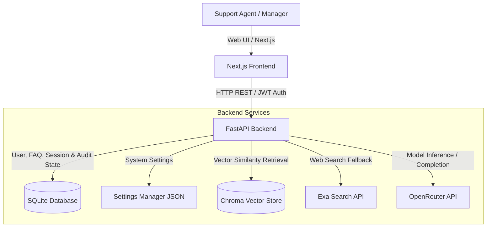

# System Architecture & Technical Report: Kairo

This report provides a comprehensive technical breakdown of Kairo, an enterprise-grade customer support assistant, RAG (Retrieval-Augmented Generation) engine, and FAQ routing platform. This document is compiled to provide an incoming Master Engineer with a complete structural, architectural, and operational understanding of the system.

---

## 1. System Overview & Architecture

Kairo is built on a client-server architecture, consisting of a Next.js (TypeScript/Tailwind CSS) frontend and a FastAPI (Python) backend. Persisted storage is split between a relational SQLite database (managed via SQLAlchemy ORM) for user, chat, FAQ, and analytics states, and a local Chroma vector database for semantic document retrieval.

### Architectural Blueprint



### Core Execution Workflows

1. **User Authentication**: Relies on OAuth2 Password Bearer flow. Relational database tables track credentials. Cryptographic hashing is managed using bcrypt. Access tokens are short-lived JSON Web Tokens (JWT).
2. **Canned FAQ Matching**: Operates as a deterministic pre-flight routing layer. Before querying vector databases or generating LLM completions, user questions are parsed against active FAQ rules in SQLite. The system implements a longest-prefix matching strategy to select the most specific keyword rule. If matched, the canned response is returned immediately, reducing latency to sub-millisecond ranges and bypassing API costs.
3. **Semantic Knowledge Retrieval (RAG)**: If no FAQ keyword matches, the system performs a vector search in ChromaDB. Retrieved chunks are filtered using a strict similarity threshold (default: 0.15). If valid chunks exist, they are passed as context to the primary LLM (via OpenRouter) to compile a grounded answer.
4. **Adaptive Web Search Fallback**: If local document context is sparse or if the primary LLM generates a refusal message (e.g. containing phrases like "don't know"), the query is verified for support relevance. If validated, the pipeline queries the Exa Neural Search API to fetch high-quality online documentation, manufacturer manuals, or external guides, returning them with verified inline citations.
5. **Multi-Agent Research Pipeline**: For advanced search operations, the system runs a 3-agent orchestration flow:
    - **Researcher Agent**: Retrieves documents or falls back to web searches, extracting raw factual atomic claims.
    - **Verification Agent**: Audits every claim against raw sources to check for hallucinations, categorizing each claim as SUPPORTED, CONTRADICTED, or UNVERIFIED.
    - **Synthesis Agent**: Compiles the final report in clean markdown, populating a Claim Verification Matrix and computing a holistic Trust Index.

---

## 2. Relational Database Schema (SQLite)

The SQLite database (`users.db` located under the `Backend` directory) manages relational integrity. The primary tables are structured as follows:

```mermaid
erDiagram
    users {
        int id PK
        string username UNIQUE
        string hashed_password
        string role
    }
    chat_sessions {
        int id PK
        int user_id FK
        string title
        datetime created_at
    }
    chat_messages {
        int id PK
        int session_id FK
        string role
        string content
        string citations
        float confidence
        string source_type
        string claims_verification
        float overall_trust_score
        datetime created_at
    }
    faq_rules {
        int id PK
        string keyword UNIQUE
        string response
        boolean is_active
        datetime created_at
    }
    failed_retrievals {
        int id PK
        string query_text
        float highest_score
        boolean fallback_triggered
        datetime created_at
    }
    audit_logs {
        int id PK
        int user_id FK
        string username
        string action
        string query_text
        string answer_preview
        float confidence
        string source_type
        string detail
        datetime created_at
    }

    users ||--o{ chat_sessions : "creates"
    chat_sessions ||--o{ chat_messages : "contains"
```

---

## 3. Configuration & Environment Setup

The backend loads configuration settings from a `.env` file located in the project root directory.

### Environment File Template
The following variables must be configured in `c:\Users\VICTUS\Kairo\.env`:

```env
# --- Required: AI Model & Retrieval API Keys ---
OPENROUTER_API_KEY=your-openrouter-api-key-here
EXA_API_KEY=your-exa-api-key-here                 # Needed for web-search fallback
LANGCHAIN_API_KEY=your-langsmith-key-here         # Optional: for LangSmith tracing

# --- Required: Authentication Security ---
# Generate a secure key using: python -c "import secrets; print(secrets.token_urlsafe(48))"
SECRET_KEY=your-secret-key-here

# For local development only, set ALLOW_EPHEMERAL_SECRET=1 to auto-generate a throwaway secret at startup
ALLOW_EPHEMERAL_SECRET=1

# Access token duration in minutes
ACCESS_TOKEN_EXPIRE_MINUTES=120

# --- First-run Admin Bootstrap Configuration ---
# Used to bootstrap the first manager account via POST /register_admin
ADMIN_SETUP_TOKEN=bootstrap-admin-token-12345

# --- CORS Origin Allowances ---
# Comma-separated list of origins allowed to call the backend API
ALLOWED_ORIGINS=http://localhost:3000

# --- Maximum Document Upload Size ---
MAX_UPLOAD_MB=50
```

---

## 4. Operational Instructions: Running the System

### Running the Backend

1. Navigate to the backend directory:
    ```bash
    cd Backend
    ```
2. Create and activate a Python virtual environment:
    ```bash
    python -m venv venv
    # Windows:
    .\venv\Scripts\activate
    # macOS/Linux:
    source venv/bin/activate
    ```
3. Install the required Python packages:
    ```bash
    pip install -r requirements.txt
    ```
4. Verify that the `.env` file exists at the project root (`../.env`) and contains the correct configurations.
5. Start the FastAPI development server:
    ```bash
    uvicorn app:app --reload --port 8000
    ```
    *The API will be available at http://localhost:8000, and interactive API documentation will be exposed at http://localhost:8000/docs.*

### Running the Frontend

1. Navigate to the frontend directory:
    ```bash
    cd frontend
    ```
2. Install the frontend dependencies:
    ```bash
    npm install
    ```
3. Create a `.env.local` file inside the `frontend` folder containing:
    ```env
    NEXT_PUBLIC_API_URL=http://localhost:8000
    ```
4. Launch the Next.js local development server:
    ```bash
    npm run dev
    ```
5. Open your browser and navigate to `http://localhost:3000`.

---

## 5. Summary of Implemented Features

1. **Deterministic FAQ Matcher**: Configurable via the manager panel. Bypasses the vector store and LLM entirely for matched keywords. Evaluates multiple keyword rules, selecting the longest matching keyword to ensure high accuracy.
2. **Hybrid RAG Retrieval**: Queries local ChromaDB vectors. Uses a similarity threshold cutoff (0.15) below which context chunks are ignored. Falls back dynamically to the Exa Web Search API if local documents do not contain relevant details.
3. **Multi-Agent Orchestration Flow**: Implemented a 3-agent cooperative research, auditing, and compilation pipeline. Real-time updates, agent thoughts, and tool execution steps are streamed to the frontend via Server-Sent Events (SSE).
4. **Knowledge Gap Analytics**: Automatically captures queries that fail vector similarity threshold checks. Persists them into SQLite `failed_retrievals` and exposes an aggregated gap report in the manager panel, outlining which search topics need new documentation.
5. **Secure Authentication & Session Cache**: Includes password hashing (bcrypt), JSON Web Tokens (JWT), and role-based path validation. Chat session histories are saved to SQLite and automatically cascade-delete associated messages when a session is deleted.
6. **Rebranded Workspace Terminology**: Terminology throughout the backend, frontend, and document files has been updated to reflect "Kairo" and aligned with customer support roles:
    - Managers / Admins: Can configure settings, FAQ rules, upload files, and audit logs.
    - Support Agents: Can run chat sessions and query the assistant.

---

## 6. Shortcomings & Architectural Issues Identified

During review and development, the following system limitations were identified:

1. **State Persistence of Support Tickets in LocalStorage**:
   - *Problem*: Support tickets created by agents and reviewed by managers in `/ops_admin` are stored solely in the client browser's `localStorage` (`"support_tickets"`).
   - *Implication*: Tickets are not synchronized on the backend. A manager logging in from a different browser cannot view tickets submitted by agents, limiting the platform's multi-user capabilities.
   - *Recommended Fix*: Add a `support_tickets` table to the SQLite schema and expose endpoints under `/admin/tickets` to manage ticket lifecycle database-wide.

2. **Broad CORS Regex Configuration**:
   - *Problem*: The CORS middleware in `app.py` utilizes `allow_origin_regex=r".*"` while simultaneously setting `allow_credentials=True`.
   - *Implication*: Any website can make authenticated requests to this API, which constitutes a security risk (cross-origin request forgery vulnerability).
   - *Recommended Fix*: Restrict the CORS origin patterns to match only trusted production and staging domains.

3. **SQLite Concurrency & Multi-Process Database Locks**:
   - *Problem*: Kairo uses SQLite for persistent storage. SQLite databases do not scale well with concurrent writes.
   - *Implication*: During high concurrency (e.g. multiple agents writing chat histories, analytics telemetry, and audit logs simultaneously), SQLite can trigger write-locks, raising `sqlite3.OperationalError` and causing requests to fail.
   - *Recommended Fix*: Use PostgreSQL for production multi-worker environments. Update the `DATABASE_URL` environment parameter accordingly.

4. **Web Search Fallback Trigger Sensitivity**:
   - *Problem*: The Exa search fallback is triggered when local vector store similarity scores are below 0.15, or when the LLM outputs a refusal message containing the string "don't know".
   - *Implication*: This relies on string matching. If the LLM generates a refusal message with a different phrase (e.g., "I lack the necessary context"), the system will not trigger the web search fallback.
   - *Recommended Fix*: Implement structured LLM outputs (e.g. tool calling or JSON schema validation) to explicitly determine whether the local context was sufficient, rather than relying on regex string comparisons.

5. **Local Document Chunk Citations Lack Direct Deep Links**:
   - *Problem*: While web results return external URLs, local document citations contain document filenames and chunk snippets but lack page-level or highlight deep links.
   - *Implication*: Support agents must manually open and search through the referenced document to verify the information.
   - *Recommended Fix*: Map the `PyPDFLoader` page numbers to vector chunk metadata and return a clickable link to open the PDF at that specific page index.

6. **Unused Code Blocks**:
   - *Problem*: The function `is_greeting(text)` in `Backend/rag_pipeline.py` is fully declared but is never invoked or integrated into the main query pipeline.
   - *Implication*: Greeting messages unnecessarily invoke the vector database or model completions, wasting processing power and API tokens.
